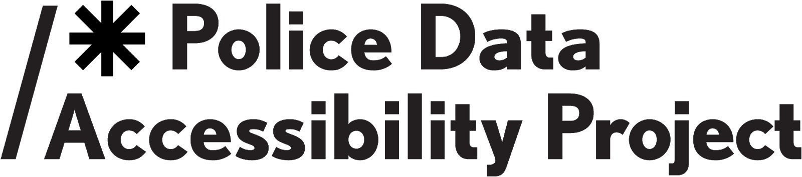

=========================
PDAP Community Onboarding
=========================

.. toctree::
   :maxdepth: 3
   :hidden:

   product_vision
   /data_access/index
   /data_collection/index
   /data_standardization/index
   /data_storage/index
   /legal/index
   /meta/index
   /tools/index
   /volunteers/index

:highlight-green:`The Police Data Accessibility Project (PDAP) aims to be a source of truth for police data.`
-------------------------------------------------------------------------------------------------------------

There are two major places to contribute: **data collection & processing** and **coding to automate those two things**.

You may find our main website `here <https://pdap.io/>`_.

How to get involved:
====================

1. **Find a task!**

   - :doc:`Write a data scraper </volunteers/resources/always_open_tasks/pdap-a2>`
   - :doc:`Collect police data directly </volunteers/resources/always_open_tasks/pdap-a1>`
   - `Work an open Volunteer Task <https://pdap.atlassian.net/issues/?filter=10016>`_
   - `Work an open Infrastructure issue <https://pdap.atlassian.net/issues/?filter=10014>`_
   - `Work an open SQL database issue <https://www.dolthub.com/repositories/pdap/datasets/issues>`_

2. Complete the `Intake Form <https://docs.google.com/forms/d/13HiD4CNTq8DOlwQtbIw2CfSjjDlveBpwxr7LRtcKeIo/edit?usp=sharing>`_ so we know what you plan to work on.
3. Head to **#volunteer-start** in `Slack <https://join.slack.com/t/policeaccessibility/shared_invite/zt-ial0bvnm-D_T7R6za4aKh1f9jGUM0pg>`_ to say hello. Slack is where you can ask questions related to what you’re working on, make suggestions, and join the PDAP community.

Resources:
==========
`Documentation <https://pdap-docs.readthedocs.io/>`_ | :doc:`Overall PDAP scope <product_vision>` | `Github org <https://github.com/Police-Data-Accessibility-Project>`_ | `Slack org <https://join.slack.com/t/policeaccessibility/shared_invite/zt-ial0bvnm-D_T7R6za4aKh1f9jGUM0pg>`_ | `DoltHub org <https://www.dolthub.com/organizations/pdap>`_
