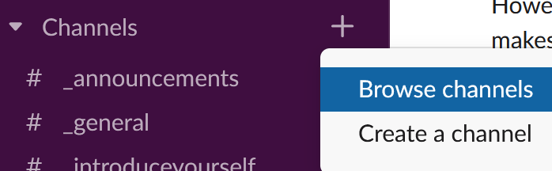
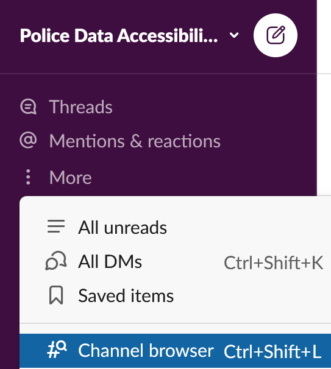

=============================
Slack - Communication
=============================
:subheader:`A beginner's guide to Slack`

Introduction
============
You can join our `Slack here <https://join.slack.com/t/policeaccessibility/shared_invite/zt-ial0bvnm-D_T7R6za4aKh1f9jGUM0pg>`_. By default, you will join the following channels:

- ``#_announcements``
- ``#_general``
- ``#_introduceyourself``
- ``#_requests``

After introducing yourself in  ``#_introduceyourself``, head to the channel browser to add yourself to more channels that may line up with your level of expertise!

Desktop
-------

For desktop clients, one way is to click the + icon next to the Channels dropdown, then click Browse Channels

The other option, at the top of the sidebar, is to click More, then click Channel browser directly from this list

Mobile
------
For mobile clients, such as iOS and Android, the process is similar.

1. On your Home tab, click the + icon next to Channels to join more channels
2. Click the Search tab, then click Browse Channels

